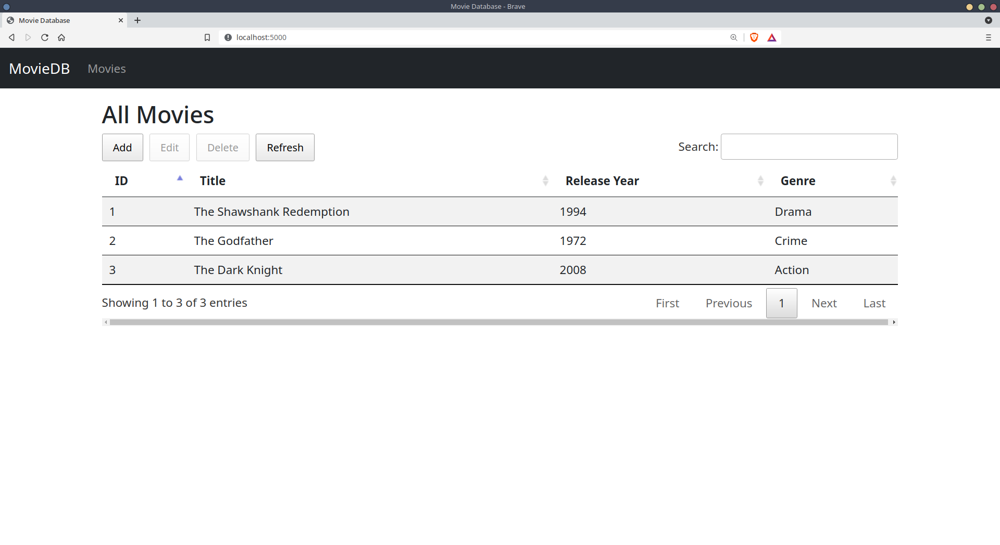

# MovieDB

This code demostrates how integrate a User-Interface developed using [Bootstrap](https://getbootstrap.com) and [JQuery](https://jquery.com) with a RESTful Web Service developed using [Flask](https://flask.palletsprojects.com/en/latest/) and [Flask RESTful](https://flask-restful.readthedocs.io). For the CRUD functionality on the front-end, [DataTable-AltEditor](https://github.com/KasperOlesen/DataTable-AltEditor) is used here instead of the official JQuery datatables. 

This is simple Movie Database Web Service which support partial CRUD functionalities via REST. Currently, this supports listing all the movie records with an HTTP **GET** request and creating new movie record with an HTTP **POST** request. Actual requests are done via Asynchronous Javascript. Updating and deleting a single movie record is yet to be supported on the back-end though.

## Install

Clone this repo on your local machine and install dependencies.

```bash
git clone https://github.com/gfabia/moviedb
cd moviedb 
pipenv install -r requirements.txt
pipenv shell
```

## Test

On the terminal, run the development server via:

```bash
python moviedb.py
```

Then access the server at http://127.0.0.1/5000. One the page loads, you should be able to see all the movie records presented in tabular format (see figure below). From there, you can add a new record by clicking the Add button.



